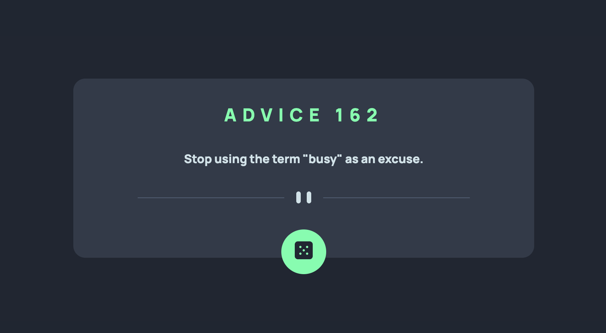
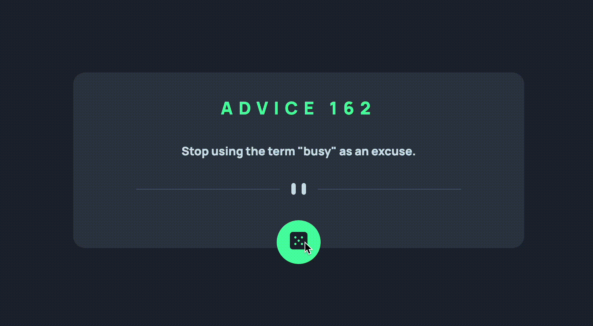

# Frontend Mentor - Advice generator app solution

This is my solution to the [Advice generator app challenge on Frontend Mentor](https://www.frontendmentor.io/challenges/advice-generator-app-QdUG-13db). 

## Table of contents

- [Overview](#overview)
  - [The challenge](#the-challenge)
  - [Screenshot](#screenshot)
- [My process](#my-process)
  - [Built with](#built-with)
- [Author](#author)

## Overview

### The challenge

Users should be able to:

- View the optimal layout for the app depending on their device's screen size
- See hover states for all interactive elements on the page
- Generate a new piece of advice by clicking the dice icon

Note: Advice is cached for 2 seconds. Any repeat-request within 2 seconds will return the same piece of advice.

### Screenshot

## My process

### Built with

- HTML5
- CSS
- Flexbox
- Javascript

## Author
- Linkedin - [@ottosuhett](https://www.linkedin.com/in/ottopereira/)

